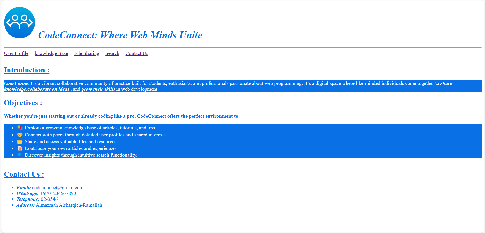

# 🌐 Web Applications Portfolio – HTML Static Site

This is the first assignment for my **Web Applications** course. It’s a static website built using pure HTML — designed to introduce me, showcase my progress, and serve as a hub for all the assignments and projects I’ll complete throughout the semester.

## 📄 About the Project

- The homepage introduces **who I am**, my interests, and what I hope to achieve during the course.
- It serves as the **navigation hub** for all future assignments and projects.
- It includes a finished first assignment:  
  A **community webpage** for web developers to connect, share knowledge, and support one another.

## 🔧 Tech Stack

- **HTML5** only (no CSS or JS yet)
- Fully static website
  
## 📌 Features

- Simple, clean navigation  
- Fully accessible via internal HTML links  
- Expands as the course progresses

## 🎯 Assignment 1 Highlight

**Web Developer Community Page**  
A static webpage that outlines a community platform for developers to:
- Share resources and tutorials  
- Connect with other learners and pros  
- Stay updated with upcoming tech trends

## 🧠 What I Learned

- Structuring HTML pages for clarity and accessibility  
- Linking between pages using relative paths  
- Organizing content in a user-friendly format
## 📸 Screenshots

- **Homepage**
  
  

- **Developer Community Page**
  
  
  
  
  

